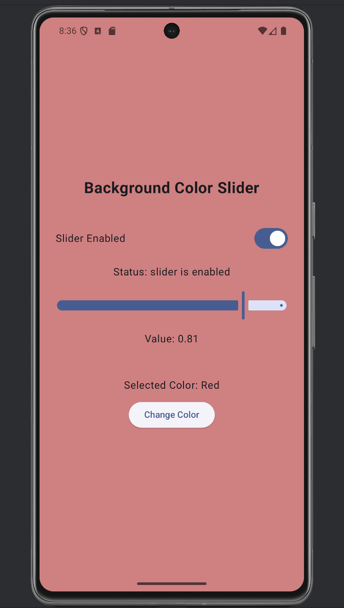

# CS501_GroupAssignment2
- Work Done By: Cody, Jevon, and Justin

    o What makes Compose declarative?
  
    o Where is state stored?
      The Composition UI element states are stored as objects in the `remember`ed variables that are declared within the function scope. These objects are stored in memory similar to any other variable. When the composition is rendered or refreshed, these objects are recalled by Compose and will be updated if there are new changes that affect their state.
  
      Source: https://developer.android.com/develop/ui/compose/state#state-in-composables

    o Which composables are stateful vs stateless?
    
    o How does this differ from XML + View logic?
    

Includes: 
1. Background Color Slider that constantly changes color when the user drags the slider across the screen.

2. Button that switches the selected RGB value when pressed.

3. A slider enable/disable toggle was added using a Switch component.

